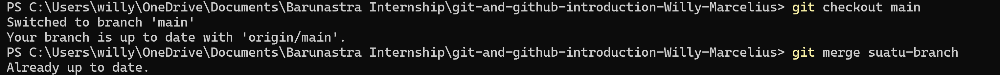

# Git and Github Introduction

| Nama              | Division  | Sub-Division  |
| ----------------- | ----------| ----------    |
| Willy Marcelius   | PGR       | Vision        |

## Early Procedure
A. Prosedur Awal
1. Menginstall Git di Laptop
https://git-scm.com/downloads

2. Membuat akun GitHub
https://github.com/join

3. Mengatur Username dan Email GitHub pada Command Prompt
git config --global user.name "Username"
git config --global user.email "Email"

4. Membuat SSH Keys pada laman Github
a. Masuk ke GitHub dan arahkan ke Settings -> SSH and GPG Keys -> klik New SSH Key

b. Buka PowerShell dan jalankan 
ssh-keygen -t ed25519 -C "email"
## kemudian tekan enter hingga menyelesaikan pembuatan key ##

c. Salin SSH Key dengan perintah berikut
Get-Content ~/.ssh/id_ed25519.pub | clip

d. Paste salinan di GitHub pada bagian key di New SSH Key

## Create Repository
B. Membuat Repositori
1. Buka laman GitHub
 https://github.com/new
 
2. Masukkan nama repositori dan tipenya (private/public), kemudian click create repository
3. Buka repository yang telah dibuat
4. Klik Code > pilih SSH > klik ikon dua kotak untuk menyalin link SSH

5. Hubungkan ke local folder dengan cara git clone
a. Beralih ke Folder Parent yang dipilih, lalu jalankan perintah
git clone [link SSH]
b. Folder akan muncul pada Folder Parent yang dipilih
c. Buka folder tersebut
d. klik kanan dan buka Terminal
e. Masukkan command line berikut di Terminal
git branch -M main

## Push File from Local to Github
C. Mengunggah File dari Local ke GitHub
1. Folder yang telah dibuat dapat diisi oleh file apapun, tetapi perlu diupload ke GitHub
2. Isi folder di local dengan file yang ingin diupload ke GitHub
3. Klik kanan pada file dan buka Terminal
4. Masukkan perintah berikut pada Terminal
git add .
git commit -m "(deskripsi bebas)"
git push origin (branch yang ingin diupload)

## Create New Branch in Github 
D. Membuat Branch Baru di GitHub
1. Branch pada GitHub adalah versi lain dari suatu folder yang memungkinkan developer untuk membuat cabang 
dari kode utama proyek tanpa mengganggu branch utama
2. Buka folder yang telah terhubung dengan GitHub
3. Klik kanan pada folder dan buka Terminal
4. Masukkan perintah berikut pada terminal
git checkout -B (nama-branch)
5. Masukkan perintah berikut untuk pindah ke branch yang telah dibuat
git checkout (nama-branch)

## Delete Branch in Github
E. Menghapus Branch di GitHub
1. Pindah ke branch lain yang tidak akan dihapus dengan perintah berikut
git checkout (nama-branch-yang-tidak-dihapus)
2. Setelah berpindah ke branch lain, jalankan perintah berikut untuk menghapus branch yang ingin dihapus
git branch -d (nama-branch-yang-ingin-dihapus)

## Merging Branch in Github
F. Menggabungkan Branch di Github
1. Pindah ke branch utama dengan command line berikut
git checkout (nama-branch-utama)
2. Setelah berada di branch utama, jalankan perintah berikut untuk menggabungkan branch
git merge (nama-branch-yang-digabung)

## Other Procedure
G. Cara menambahkan gambar/dokumentasi pada file README.md di VS Code
1. Pastikan foto sudah tersimpan di folder 
2. Tambahkan foto dengan perintah berikut
